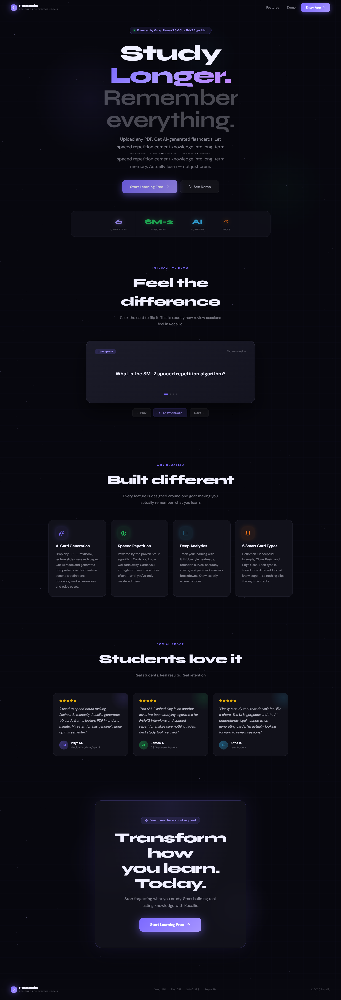
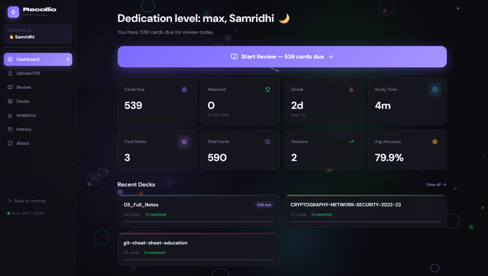
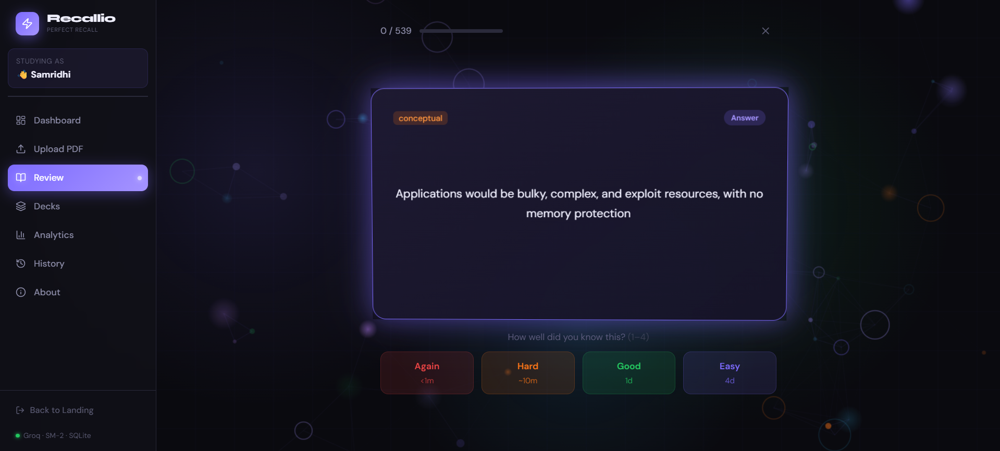
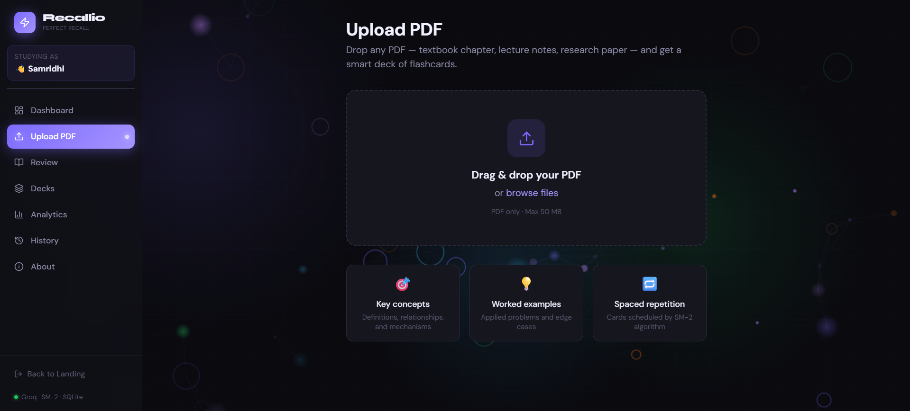

# Recallio — Designed for Perfect Recall

> *Turn any PDF into a world-class study deck. Let science handle what you review and when.*

[](https://python.org)
[](https://fastapi.tiangolo.com)
[](https://react.dev)
[](https://typescriptlang.org)
[](https://groq.com)
[](LICENSE)

---

## What Is This?

Recallio converts any PDF — a textbook chapter, lecture notes, research paper — into a rich set of high-quality flashcards, then uses the scientifically-proven **SM-2 spaced repetition algorithm** to schedule exactly what you should study and when. Cards you know well fade away. Cards you're struggling with keep surfacing. Over time, you build genuine long-term retention — not the illusion of it.

The LLM (Groq) doesn't just scrape surface-level facts. It generates cards across multiple cognitive levels: definitions, relationships, edge cases, worked examples, and conceptual "why" questions — the kind a great teacher would write.

This isn't a utility. It's a complete, polished learning experience — from a premium animated landing page down to a smooth, keyboard-driven review session.

---

## Product Experience

Recallio is designed to feel like a real product, not a side project.

**Landing Page (`/`)** — A fully animated hero with parallax scrolling, an interactive 3D flashcard demo you can flip right on the page, feature cards with hover glow, student testimonials, and a clear CTA flow. Built to impress at first glance.

**Onboarding (`/onboarding`)** — A focused, minimal name-input screen. No account. No friction. Just a name, stored locally via Zustand, and you're in.

**User Flow:**
```
/ (Landing)
  → "Start Learning Free"
      → if returning user  → /dashboard
      → if new user        → /onboarding → enter name → /dashboard
```

**Inside the app:** Every page lives inside a dark, space-themed UI with floating orb animations, smooth page transitions via Framer Motion, and a persistent sidebar that greets you by name. The review session is keyboard-first, distraction-free, and satisfying to use.

---

## Feature Overview

| Area | What It Does |
|---|---|
| **Landing Page** | Animated hero, interactive flashcard demo, testimonials, CTA — a full product landing |
| **Onboarding** | Name input with quick-select chips; stored locally, no account required |
| **PDF Ingestion** | Upload any PDF; smart chunking + Groq extracts high-quality cards (15–40 per doc) |
| **Card Types** | Basic Q&A, Cloze deletion, Definition, Worked Example, Conceptual, Edge Case |
| **SM-2 SRS** | Cards scheduled by ease factor + interval; you never manually decide what to study |
| **Review Session** | 3D flip animation, self-rating (Again / Hard / Good / Easy), keyboard shortcuts |
| **Dashboard** | Cards due today, streak, mastery %, upcoming reviews — personalized by name |
| **Analytics** | Heatmap, retention curve, cards-per-day chart, per-deck mastery breakdown |
| **History** | Every session logged — date, deck, duration, accuracy, cards covered |
| **Deck Manager** | Browse, search, tag, rename, delete decks |
| **About** | How the app works, algorithm explainer, Groq attribution |

---

## Screenshots

| Landing | Dashboard | Review |
|---|---|---|
|  |  |  |

| Upload | Decks | Analytics |
|---|---|---|
|  |  |  |

> **Live demo:** [github.com/SamridhiiiGupta/Recallio--Designed_for_perfect_recall](https://github.com/SamridhiiiGupta/Recallio--Designed_for_perfect_recall)

---

## System Architecture

```
┌─────────────────────────────────────────────────────────┐
│                     BROWSER (localhost:5173)             │
│                                                         │
│  React 18 + TypeScript + Vite + TailwindCSS             │
│  Framer Motion  │  Zustand  │  TanStack Query  │  Recharts│
└────────────────────────┬────────────────────────────────┘
                         │ HTTP (REST)
                         ▼
┌─────────────────────────────────────────────────────────┐
│                  FastAPI (localhost:8000)                │
│                                                         │
│  /api/upload   →  PDF Parser (PyMuPDF)                  │
│                     └→ Groq API  ──────────────────────►│
│                         (llama-3.3-70b-versatile)       │
│  /api/review   →  SRS Engine (SM-2)                     │
│  /api/analytics→  Analytics Service                     │
└────────────────────────┬────────────────────────────────┘
                         │ SQLAlchemy ORM
                         ▼
┌─────────────────────────────────────────────────────────┐
│                   SQLite (local file)                   │
│         flashmind.db  — zero infrastructure             │
└─────────────────────────────────────────────────────────┘
```

**Key design decision — SQLite:** Single-user, local app. SQLite gives zero-setup persistence, full SQL power, and no Docker/Postgres dependency. The entire state of the app lives in one portable `.db` file.

---

## Tech Stack

### Backend
| Package | Version | Purpose |
|---|---|---|
| `fastapi` | 0.111 | API framework |
| `uvicorn` | 0.30 | ASGI server |
| `sqlalchemy` | 2.0 | ORM |
| `alembic` | 1.13 | DB migrations |
| `pydantic` | 2.x | Request/response validation |
| `pymupdf` (fitz) | 1.24 | PDF text + structure extraction |
| `groq` | latest | LLM client (card generation) |
| `python-multipart` | — | File uploads |
| `python-dotenv` | — | Env var loading |

### Frontend
| Package | Version | Purpose |
|---|---|---|
| `react` | 18 | UI framework |
| `typescript` | 5 | Type safety |
| `vite` | 5 | Build tool |
| `tailwindcss` | 3 | Styling |
| `framer-motion` | 11 | Card flip + page animations |
| `zustand` | 4 | Global state (user identity, session, deck) |
| `@tanstack/react-query` | 5 | Server state, caching, refetch |
| `recharts` | 2 | Analytics charts |
| `react-router-dom` | 6 | Client-side routing |
| `react-dropzone` | — | PDF drag-and-drop upload |
| `axios` | — | HTTP client |
| `lucide-react` | — | Icon set |

---

## Project Structure

```
recallio/
├── backend/
│   ├── alembic/                     # DB migration scripts
│   ├── app/
│   │   ├── routers/
│   │   │   ├── upload.py            # POST /upload — PDF ingestion pipeline
│   │   │   ├── decks.py             # CRUD for decks
│   │   │   ├── cards.py             # Card CRUD + bulk ops
│   │   │   ├── review.py            # Session start/answer/end
│   │   │   ├── analytics.py         # Charts data endpoints
│   │   │   └── history.py           # Study session history
│   │   ├── services/
│   │   │   ├── pdf_parser.py        # PyMuPDF → structured text chunks
│   │   │   ├── card_generator.py    # Groq API — prompt + parse + validate
│   │   │   └── srs_engine.py        # SM-2 algorithm + scheduling
│   │   ├── config.py                # App config + env var loading
│   │   ├── database.py              # SQLAlchemy engine + session
│   │   ├── main.py                  # FastAPI app + CORS + routers
│   │   ├── models.py                # ORM models (Deck, Card, SRS, Session)
│   │   └── schemas.py               # Pydantic request/response schemas
│   ├── .env.example
│   ├── alembic.ini
│   ├── flashmind.db                 # Auto-created on first run
│   └── requirements.txt
│
├── frontend/
│   ├── public/
│   │   ├── favicon.svg
│   │   └── icons.svg
│   ├── src/
│   │   ├── api/
│   │   │   └── client.ts            # Axios instance + typed API calls
│   │   ├── assets/
│   │   │   └── hero.png
│   │   ├── components/
│   │   │   ├── cards/
│   │   │   │   ├── FlashCard.tsx    # 3D flip card component
│   │   │   │   └── RatingBar.tsx    # Again/Hard/Good/Easy buttons
│   │   │   ├── layout/
│   │   │   │   ├── FloatingBackground.tsx  # Animated orb/particle background
│   │   │   │   ├── Layout.tsx       # Page wrapper
│   │   │   │   └── Sidebar.tsx      # Navigation + user greeting
│   │   │   └── ui/
│   │   │       ├── Badge.tsx
│   │   │       ├── Spinner.tsx
│   │   │       ├── StatCard.tsx     # Dashboard stat tiles
│   │   │       └── TiltCard.tsx     # Mouse-tilt interactive card
│   │   ├── hooks/
│   │   │   └── useCardTilt.ts       # Mouse parallax tilt hook
│   │   ├── pages/
│   │   │   ├── About.tsx            # App info + algorithm explainer
│   │   │   ├── Analytics.tsx        # Full analytics dashboard
│   │   │   ├── Dashboard.tsx        # Home — stats + due cards + streak
│   │   │   ├── DeckDetail.tsx       # Single deck — all cards + edit
│   │   │   ├── Decks.tsx            # All decks grid view
│   │   │   ├── History.tsx          # Past sessions timeline
│   │   │   ├── Landing.tsx          # Animated landing page
│   │   │   ├── Onboarding.tsx       # Name input + entry flow
│   │   │   ├── Review.tsx           # Active study session
│   │   │   └── Upload.tsx           # Drag-and-drop PDF → card generation
│   │   ├── store/
│   │   │   ├── reviewStore.ts       # Active session state
│   │   │   └── userStore.ts         # Zustand store — user name, persistence
│   │   ├── utils/
│   │   │   └── getGreeting.ts       # Time-based greeting helper
│   │   ├── App.css
│   │   ├── App.tsx                  # Router setup (Landing → Onboarding → App)
│   │   ├── index.css
│   │   └── main.tsx
│   ├── index.html
│   ├── vite.config.ts
│   └── package.json
│
├── package.json                     # Root — single `npm run dev` starts everything
├── start.sh                         # Shell bootstrap script
├── README.md
└── CLAUDE.md
```

---

## Database Schema

```sql
-- A study deck (one PDF = one deck)
CREATE TABLE decks (
    id          TEXT PRIMARY KEY,     -- UUID
    title       TEXT NOT NULL,
    description TEXT,
    source_file TEXT NOT NULL,        -- original PDF filename
    tags        TEXT,                 -- comma-separated
    card_count  INTEGER DEFAULT 0,
    created_at  DATETIME NOT NULL,
    updated_at  DATETIME NOT NULL
);

-- Individual flashcards
CREATE TABLE cards (
    id          TEXT PRIMARY KEY,
    deck_id     TEXT NOT NULL REFERENCES decks(id) ON DELETE CASCADE,
    front       TEXT NOT NULL,        -- question / prompt
    back        TEXT NOT NULL,        -- answer / explanation
    card_type   TEXT NOT NULL,        -- basic | cloze | definition | example | conceptual
    hint        TEXT,                 -- optional hint shown before reveal
    tags        TEXT,
    created_at  DATETIME NOT NULL
);

-- SM-2 state per card (one row per card, updated after every review)
CREATE TABLE card_srs (
    card_id       TEXT PRIMARY KEY REFERENCES cards(id) ON DELETE CASCADE,
    ease_factor   REAL DEFAULT 2.5,
    interval      INTEGER DEFAULT 0,  -- days until next review
    repetitions   INTEGER DEFAULT 0,  -- consecutive correct reviews
    due_date      DATETIME NOT NULL,  -- next scheduled review
    state         TEXT DEFAULT 'new'  -- new | learning | review | mastered
);

-- One row per study session
CREATE TABLE study_sessions (
    id              TEXT PRIMARY KEY,
    deck_id         TEXT REFERENCES decks(id) ON DELETE SET NULL,
    deck_title      TEXT,             -- snapshot in case deck is deleted
    started_at      DATETIME NOT NULL,
    ended_at        DATETIME,
    cards_reviewed  INTEGER DEFAULT 0,
    correct_count   INTEGER DEFAULT 0, -- quality >= 3
    duration_secs   INTEGER DEFAULT 0
);

-- One row per card answer within a session
CREATE TABLE card_reviews (
    id              TEXT PRIMARY KEY,
    session_id      TEXT NOT NULL REFERENCES study_sessions(id),
    card_id         TEXT NOT NULL REFERENCES cards(id) ON DELETE CASCADE,
    quality         INTEGER NOT NULL,  -- 0-5 (SM-2 scale)
    time_taken_ms   INTEGER,
    reviewed_at     DATETIME NOT NULL,
    ease_before     REAL,
    interval_before INTEGER
);
```

---

## API Reference

### Upload & Ingestion
```
POST   /api/upload                  Multipart PDF upload → triggers generation pipeline
GET    /api/upload/{job_id}/status  Poll generation progress (SSE or polling)
```

### Decks
```
GET    /api/decks                   List all decks (with stats)
GET    /api/decks/{id}              Single deck + all its cards
PATCH  /api/decks/{id}              Update title, description, tags
DELETE /api/decks/{id}              Delete deck + all cards
```

### Cards
```
GET    /api/cards/due               Cards due for review today (all decks)
GET    /api/decks/{id}/cards        All cards in a deck
PATCH  /api/cards/{id}              Edit front/back/hint
DELETE /api/cards/{id}              Delete single card
```

### Review Sessions
```
POST   /api/review/start            Start session → { session_id, first_card }
POST   /api/review/answer           Submit answer quality (0–5) → { next_card, srs_update }
POST   /api/review/end              End session early → final stats
GET    /api/review/session/{id}     Session summary
```

### Analytics
```
GET    /api/analytics/overview      Total cards, mastered, retention rate, streak
GET    /api/analytics/heatmap       Daily study counts (last 365 days)
GET    /api/analytics/retention     Retention curve data per deck
GET    /api/analytics/decks         Per-deck mastery breakdown
GET    /api/analytics/daily-cards   Cards reviewed per day (last 30 days)
```

### History
```
GET    /api/history                 All sessions (paginated, filterable by deck/date)
GET    /api/history/{id}            Single session detail + card-by-card breakdown
```

---

## Spaced Repetition — SM-2 Algorithm

Every card carries three values: `ease_factor` (EF), `interval` (days), `repetitions`.

```
After each review, user rates quality q ∈ {0, 1, 2, 3, 4, 5}
  0 = Complete blackout
  1 = Wrong, but felt familiar  
  2 = Wrong, easy recall
  3 = Correct, significant effort   ← threshold
  4 = Correct, some hesitation
  5 = Perfect recall, instant

If q < 3  (failed):
    repetitions = 0
    interval    = 1
    state       = 'learning'

If q >= 3  (passed):
    if repetitions == 0:  interval = 1
    if repetitions == 1:  interval = 6
    else:                 interval = round(interval * ease_factor)
    repetitions += 1
    state = 'review' if interval < 21 else 'mastered'

EF update (always):
    EF = EF + (0.1 - (5 - q) * (0.08 + (5 - q) * 0.02))
    EF = max(1.3, EF)          # floor at 1.3

due_date = today + interval days
```

Cards in state `new` are interleaved with `learning` cards so new material is always being introduced alongside review.

---

## LLM Card Generation Strategy

The quality of generated cards is the hardest problem. The pipeline:

### 1. PDF Parsing (PyMuPDF)
- Extract text preserving heading hierarchy (H1 → H2 → paragraph)
- Detect and skip headers, footers, page numbers
- Split into semantic chunks of ~800–1200 tokens with overlap
- Each chunk carries its section title as context

### 2. Groq Prompt Design
Cards are generated in a **structured JSON format** via a carefully engineered system prompt:

```
System: You are an expert educator creating flashcards for deep learning.
        Generate cards at multiple cognitive levels:
        - DEFINITION: precise definitions of key terms
        - CONCEPT: "why" and "how" questions about mechanisms  
        - RELATIONSHIP: how concepts connect or contrast
        - EXAMPLE: worked examples or applications
        - EDGE_CASE: common mistakes, boundary conditions

        Rules:
        - Front must be specific and unambiguous
        - Back must be complete but concise (< 80 words)
        - No trivial yes/no questions
        - Vary difficulty: 40% recall, 40% understanding, 20% application
        - Output valid JSON array only

User: [section title + chunk text]
```

### 3. Post-Processing
- Parse and validate JSON output
- Deduplicate cards by semantic similarity (simple token overlap check)
- Filter cards where front or back is too short/long
- Assign `card_type` from the LLM's category tag
- Bulk insert with initial SRS state (`due_date = today`)

Target: **15–40 high-quality cards per PDF**, not 100 shallow ones.

---

## UI Pages

### Landing (`/`)
- Animated hero with cycling text (Smarter / Faster / Deeper / Longer)
- Parallax scroll effects and floating particle background
- Interactive 3D flashcard demo — click to flip, right on the page
- Feature cards with hover glow effects
- Student testimonials section
- Dual CTA: "Start Learning Free" → onboarding / dashboard

### Onboarding (`/onboarding`)
- Centered name-input card — clean, minimal, focused
- Quick-select name chips for fast entry
- Name persisted via Zustand + localStorage — no account required
- "Stored locally. No account required." — trust signal on screen

### Dashboard (`/dashboard`)
- Personalized greeting using stored user name
- Today's due cards count with a "Start Review" CTA
- Current study streak (days)
- Total mastered / total cards ratio
- Mini upcoming review calendar (next 7 days)
- Recently added decks

### Upload
- Full-screen drag-and-drop zone
- Real-time progress: "Parsing PDF → Analyzing content → Generating cards → Done"
- Preview of generated cards before saving
- Option to regenerate or delete individual cards before saving

### Review Session
- One card at a time, centered on screen
- Front shown first; spacebar / click to flip (3D flip animation via Framer Motion)
- Rating buttons: **Again** · **Hard** · **Good** · **Easy** (with estimated next review time shown)
- Keyboard shortcuts: Space = flip, 1/2/3/4 = rate
- Session progress bar + cards remaining
- "End Session" available at any point

### Decks
- Card grid with deck thumbnail (auto-generated gradient based on title hash)
- Shows: card count, mastery %, last studied date
- Search + tag filter
- Sort by: newest, most due, mastery %, alphabetical

### History
- Vertical timeline of all study sessions
- Each entry: deck name, date, duration, accuracy %, cards reviewed
- Click to expand → full card-by-card breakdown of that session
- Filter by deck or date range

### Analytics
- **Study Heatmap** — GitHub contribution-style grid (last 52 weeks)
- **Daily Cards Chart** — bar chart of cards reviewed per day (last 30 days)
- **Mastery Breakdown** — stacked bar per deck: New / Learning / Review / Mastered
- **Retention Curve** — estimated forgetting curve overlay
- **Top Stats** — total study time, longest streak, best day, average accuracy

---

## Setup & Installation

### Prerequisites
- Python 3.11+
- Node.js 20+
- A Groq API key — get one free at [console.groq.com](https://console.groq.com)

### 1. Clone the repo
```bash
git clone https://github.com/SamridhiiiGupta/Recallio--Designed_for_perfect_recall.git
cd Recallio--Designed_for_perfect_recall
```

### 2. Set up the backend
```bash
cd backend

python -m venv venv
source venv/bin/activate        # Windows: venv\Scripts\activate

pip install -r requirements.txt

cp .env.example .env
# Open .env and add your GROQ_API_KEY

alembic upgrade head             # Creates flashmind.db with schema
```

### 3. Install frontend dependencies
```bash
cd ../frontend
npm install
```

### 🚀 Run (single command)

From the project root:

```bash
npm run dev
```

This starts **both** the FastAPI backend and the Vite frontend in one terminal. Visit **[http://localhost:5173](http://localhost:5173)** — upload a PDF and start studying.

---

## Environment Variables

```bash
# backend/.env
GROQ_API_KEY=gsk_...             # Required — Groq API key
GROQ_MODEL=llama-3.3-70b-versatile  # Model to use for card generation
DATABASE_URL=sqlite:///./flashmind.db
CORS_ORIGIN=http://localhost:5173
MAX_PDF_SIZE_MB=50
CARDS_PER_CHUNK=5                # Cards to generate per text chunk
```

---

## Development Commands

```bash
# Backend (if running separately)
uvicorn app.main:app --reload --port 8000
alembic revision --autogenerate -m "description"
alembic upgrade head

# Frontend (if running separately)
npm run dev          # Dev server
npm run build        # Production build
npm run lint         # ESLint check
npm run type-check   # TypeScript check (tsc --noEmit)

# Reset database (fresh start)
rm flashmind.db && alembic upgrade head
```

---

## Roadmap

### Phase 1 — Core ✅
- [x] Project architecture + README
- [x] Backend: DB models + migrations
- [x] Backend: PDF parsing service
- [x] Backend: Groq card generation service
- [x] Backend: SM-2 SRS engine
- [x] Backend: All API routes
- [x] Frontend: Layout + routing + dark theme
- [x] Frontend: Upload page + progress flow
- [x] Frontend: Review session (flip card + rating)
- [x] Frontend: Dashboard

### Phase 2 — Polish ✅
- [x] Frontend: Analytics dashboard
- [x] Frontend: History timeline
- [x] Frontend: About page
- [x] Keyboard shortcuts + accessibility
- [x] Animated landing page + onboarding flow
- [x] Zustand-persisted user identity (no auth required)
- [x] Single-command dev setup (`npm run dev`)
- [ ] Card editing UI
- [ ] Export deck as Anki-compatible `.apkg`

### Phase 3 — Delight
- [ ] Sound effects on card flip / session complete
- [ ] Confetti on streak milestones
- [ ] "Daily goal" system with push notifications (Electron wrapper)
- [ ] Offline support (service worker)
- [ ] Multiple card themes / fonts

---

## Why Groq?

Groq's LPU inference hardware delivers sub-second latency on large models. For a card generation pipeline that processes 10+ text chunks per PDF, this means a 50-page document generates its full card deck in **under 30 seconds** rather than minutes. The `llama-3.3-70b-versatile` model used here rivals GPT-4 in instruction-following quality while being free-tier accessible.

---

*Long-term retention beats short-term cramming. Every time.*
